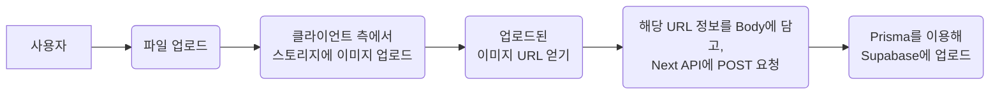
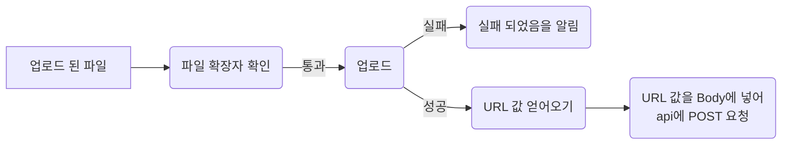

## 📌시작하며

프로젝트에서 이미지를 업로드하고, 해당 이미지를 저장할 필요가 있었다! supabase의 storage를 이용하면 되는데, 어떻게 코드를 작성했는지 돌아보며 정리해보고자 한다.

> 이 글은 아래와 같이 이어집니다.
>
> - [supabase와 prisma(1) - 기본 개념](https://saemii-24.github.io/posts/supabase-1/)
> - [supabase와 prisma(2) - prisma CRUD](https://saemii-24.github.io/posts/supabase-2/)
> - [supabase와 prisma(3) - prisma 심화](https://saemii-24.github.io/posts/supabase-3/)
> - [supabase와 prisma(4) -storage 이용하기](https://saemii-24.github.io/posts/supabase-4/)

## ✅storage

Supabase의 Storage를 사용하면 다양한 크기의 이미지, 동영상, PDF등의 파일을 간편하게 업로드 할 수 있다.

먼저, Supabase와 상호작용하는 과정에서는 Prisma를 사용하고 있는 만큼, Prisma를 이용해 업로드 할 방법을 찾아보았는데 storage 업로드에는 Supabase를 직접 사용하는 듯 했다.

다행히도 코드도 어렵지 않기 때문에 금방 작성할 수 있다!

**전체적인 업로드 과정**은 아래와 같다.



## ✅Typescript용 type 만들기

아래 코드를 터미널에 입력해 내가 만든 테이블의 type을 만들어 줄 수 있다. 이렇게 타입을 만들고 client에 적용해주면, 작성 중에 의도치 않은 오타에서 발생하는 오류를 막아줄 수 있으니 꼭 타입을 지정해주자!

```bash
npx supabase gen types typescript --project-id abcdefghijklmnopqrst > database.types.ts
```

정상 작동 되면 `database.types.ts`에 내가 만든 테이블에 적합한 타입이 자동으로 생성된다.

## ✅client 만들기

supabase client는 클라이언트, 서버, 미들웨어 이렇게 세 가지 상태에서 사용할 수 있는 client가 있다. 나는 client 측에서 스토리지에 이미지를 업로드할 예정이므로, 클라이언트 측 supabase client를 만들어 주었고, 위에서 정의한 `Database`타입을 적용해주었다.

이때 사용하는 환경 변수는 `.env.local`파일에 정의해주면 된다.

```typescript
import { createBrowserClient } from "@supabase/ssr"
import { Database } from "../../database.types"

export const createClient = () =>
  createBrowserClient<Database>(
    process.env.NEXT_PUBLIC_SUPABASE_URL!,
    process.env.NEXT_PUBLIC_SUPABASE_ANON_KEY!
  )
```

## ✅업로드 코드

전체적인 코드 흐름은 다음과 같다.



실패한 경우, 로딩 중인 경우는 toast를 띄워주고자 `react-toastify`라이브러리를 사용했고, 파일명 때문에 업로드가 실패하는 경우가 발생해 업로드 시간을 기준으로 file 명을 따로 만들어 사용해주었다.

```typescript
import { FormValues } from "@/types/form"
import { createClient } from "@/supabase/client"

import axios from "axios"
import { toast } from "react-toastify"

//react-hook-form 폼 이용
export const onSubmit = async (data: FormValues) => {
  const supabase = createClient()

  //file 이 업로드 되었을 때 처리
  let fileName = new Date().getTime()
  let file = data.thumbnail![0]

  let fileUrl = null

  if (file) {
    //이미지 업로드드
    const { data: uploadData, error } = await supabase.storage
      .from("thumbnail")
      .upload(`image_${fileName}`, file) 👈

    //만약 업로드가 실패한 경우
    if (error) {
      console.error("이미지 업로드 실패:", error.message)
      toast.error("이미지 업로드에 실패했습니다.")
    } else {
      //URL 얻기
      const { data: uploadUrl } = await supabase.storage
        .from("thumbnail")
        .getPublicUrl(uploadData!.path) 👈

      fileUrl = uploadUrl.publicUrl
    }
  }

  //파일 url로 변경 완료, api에 post 요청
  try {
    const response = await axios.post("/api/music", {
       //data = react hook form에서 얻은 내용들
      title: data.title,
      singer: data.singer,
      language: data.language,
      thumbnail: fileUrl, //URL 내용을 담아 보냄
    })
    return response.data
  } catch (err) {
    console.error("에러가 발생했습니다: ", err)
    toast.error("다시 시도해주세요.")
  }
}

//file 확인
export const checkFileType = (value?: FileList) => {
  if (value && value[0]) {
    // 확장자 확인
    const correctFormat = ["image/png", "image/jpg", "image/webp", "image/jpeg"]
    const file = value[0]
    const fileExtension = file.type.toLowerCase()

    if (value[0].size > 1048576) {
      return "* 1MB 이하 파일을 업로드해 주세요."
    }
    if (!correctFormat.includes(fileExtension)) {
      return "* PNG 또는 JPG 파일을 업로드해 주세요."
    }
  }
  return true
}
```

## ✅API 작성

업로드 api는 다음과 같이 작성해주었다. `req.json()`을 통해 body값을 구조분해 할당하고, `language`값에 따라 업로드 필드가 달라지기에, 조건문으로 처리했다.

```typescript
export const POST = async (req: Request, res: NextResponse) => {
  try {
    //body 값 받아오기
    const { title, singer, thumbnail, language } = await req.json()

    let post
    if (language === "한국어") {
      post = await prisma.post.create({
        data: {
          kotitle: title,
          kosinger: singer,
          kothumbnail: thumbnail,
        },
      })
    } else {
      post = await prisma.post.create({
        data: {
          jptitle: title,
          jpsinger: singer,
          jpthumbnail: thumbnail,
        },
      })
    }
    return NextResponse.json({ message: "Success", post }, { status: 201 })
  } catch (err) {
    return NextResponse.json({ message: "Error", err }, { status: 500 })
  }
}
```

## 📩마무리

이렇게 supabase를 써서 업로드 하는 것 까지는 전부 마무리가 되었다!
이후 이 url 사용 중에 발생한 오류는 [이렇게](https://saemii-24.github.io/posts/error-1/) 해결했다.😎

## 🗂️참고 사이트

- <https://supabase.com/docs/guides/storage>
- <https://supabase.com/docs/reference/javascript/typescript-support>
